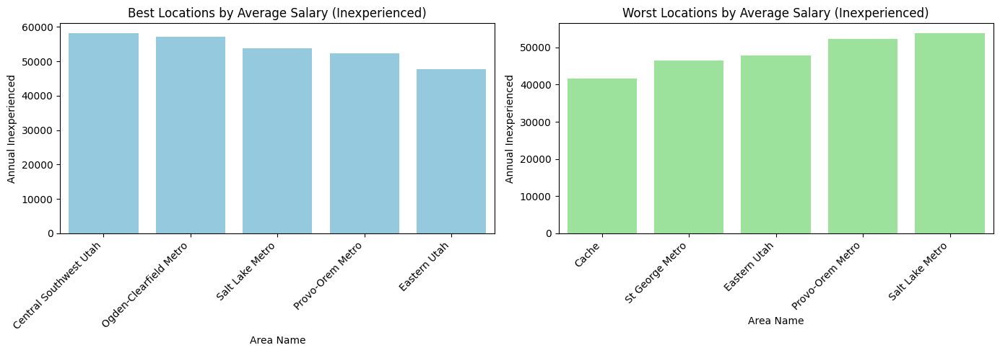
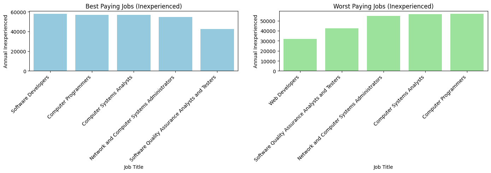
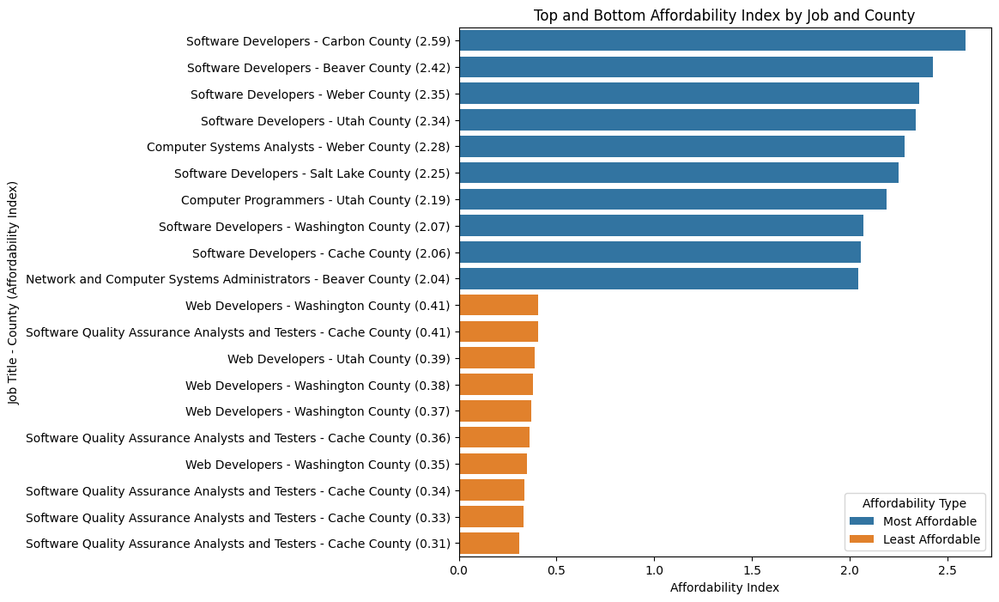
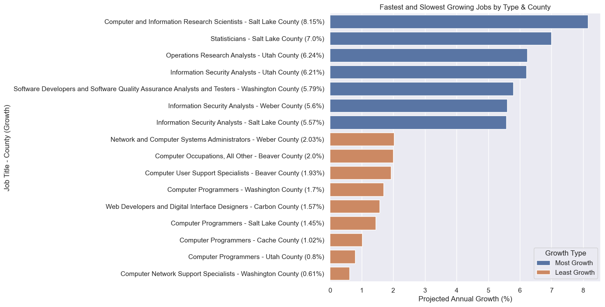

# Utah Programmer Job Market Analysis

## 📝 Project Overview

This project analyzes programmer wage data and cost of living across Utah counties to determine the most affordable locations for recent computer science graduates. By combining job wage data with local cost-of-living indices, we created an "Affordability Index" to highlight where programmers can maximize their income.

---

## 📊 Goals

- Compare programmer wages across Utah counties
- Merge cost of living and salary data to determine affordability
- Visualize wage trends by job type and location
- Build a linear regression model to predict wage based on county and job title

---

## 🧹 Data Preparation

- Cleaned and joined datasets using Pandas
- Merged cost of living and salary datasets via normalized county names
- Removed rows with missing wage data
- One-hot encoded job titles and county names for modeling

---

## 🔧 Tools & Libraries

- Python
- Pandas
- NumPy
- scikit-learn (LinearRegression, ColumnTransformer, OneHotEncoder)
- Matplotlib & Seaborn

---

## 📈 Affordability Index

A custom metric created by combining average annual wage and cost of living index per county. Formula:

```
Affordability Index = (Average Annual Wage) / (Cost of Living Index)
```

Counties with a high Affordability Index are considered more favorable for programmers.

---


## 📌 Key Findings






## 📊 T-Test Comparisons: Job Category Salary Differences

To determine whether salary differences between job categories were statistically significant, we performed pairwise **two-sample t-tests**. Results include both the t-statistic and corresponding p-value for each comparison.

---

### 🧪 Least Significant Differences

These comparisons yielded **no statistically significant** differences in salary (p > 0.05):

| Comparison | T-Statistic | P-Value |
|------------|-------------|---------|
| Computer Systems Analysts vs. Network & Computer Systems Administrators | 0.269 | 0.788 |
| Computer Programmers vs. Network & Computer Systems Administrators | 0.699 | 0.486 |
| QA Analysts & Testers vs. Web Developers | 1.125 | 0.263 |

These roles may be compensated similarly within the Utah job market.

---

### 🥇 Most Significant Differences

These comparisons revealed **strong, statistically significant** differences in salary (p < 0.001):

| Comparison | T-Statistic | P-Value |
|------------|-------------|---------|
| Software Developers vs. Web Developers | 7.095 | 7.86 × 10⁻¹¹ |
| Software Developers vs. QA Analysts & Testers | 5.603 | 1.40 × 10⁻⁷ |
| Computer Programmers vs. Web Developers | 4.612 | 1.02 × 10⁻⁵ |

These differences suggest meaningful wage disparities between roles, with **Software Developers consistently earning significantly more**.

---

## 🔮 Future Work

In future iterations of this project, we’d like to explore:

- **Predictive salary modeling** based on skills, location, and cost of living
- **Skill impact analysis** to identify which technologies and certifications lead to higher pay
- **Demand forecasting** using public labor data to find high-growth roles
- Potential expansion to an **interactive dashboard** for personalized job market insights

These additions would help make our analysis more actionable for job seekers and students planning their careers.

---

## 💬 Conclusions

This analysis helps new graduates make informed decisions about where to live and work. It also reveals systemic wage disparities between job roles and highlights counties with disproportionate living costs compared to salary expectations.
- Carbon & Beaver Counties might pay well, but they are growing very slowly. One might have an easier search in Salt Lake or Utah County
- Software Developers and Computer Programmers earn the most while QA Analysts & Testers and Web Developers earn the least
---

## 🔗 References
- [Utah Workforce Data](https://jobs.utah.gov/)
- [BLS OEWS Data](https://www.bls.gov/oes/)
- [Full Analysis Can be Viewed Here](https://github.com/Tyler-Johnston/Utah-Programmer-Job-Market-Analysis/blob/main/analysis/Utah%20Programmer%20Job%20Market%20Analysis.pdf)
- The munged data and CSVs we used are included in the project repository
