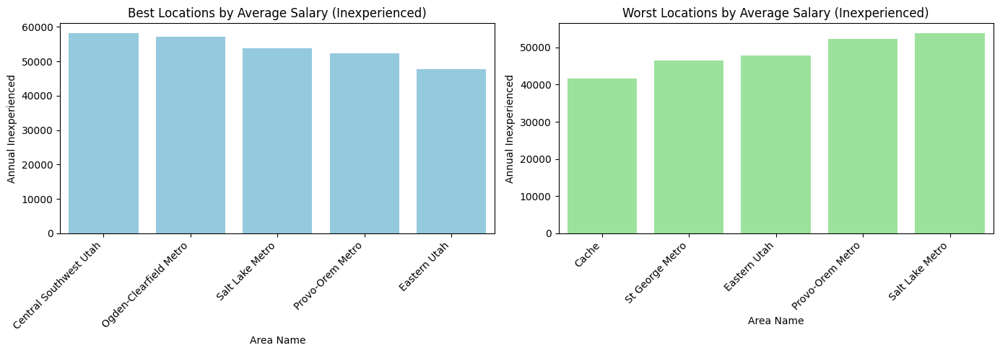
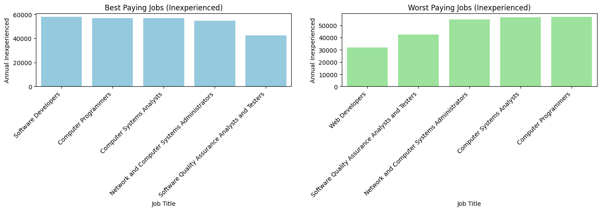
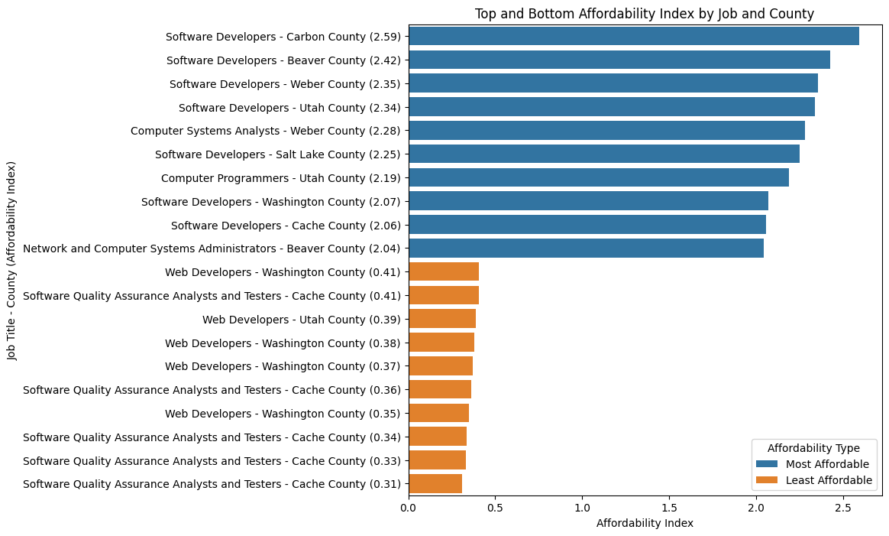
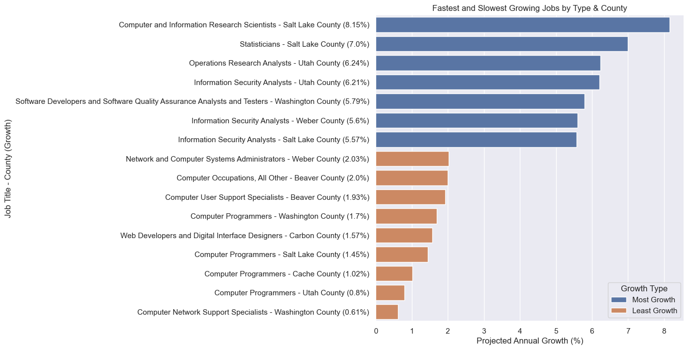

# Utah Programmer Job Market Analysis

## Project Overview

This project analyzes programmer wage data and cost of living across Utah counties to identify the most affordable locations for recent computer science graduates. By combining wage data with local cost-of-living indices, we built an Affordability Index to highlight where programmers can get the most value from their income.

---

## Goals

- Compare programmer wages across Utah counties
- Merge cost of living and salary data to determine affordability
- Visualize wage trends by job type and location
- Build a linear regression model to predict wage based on county and job title

---

## Data Preparation

- Cleaned and joined datasets using Pandas
- Merged cost of living and salary datasets via normalized county names
- Removed rows with missing wage data
- One-hot encoded job titles and county names for modeling

---

## Tools and Libraries

- Python
- Pandas
- NumPy
- scikit-learn (LinearRegression, ColumnTransformer, OneHotEncoder)
- Matplotlib and Seaborn

---

## Affordability Index

A custom metric combining average annual wage and cost of living index per county:

```
Affordability Index = (Average Annual Wage) / (Cost of Living Index)
```

Counties with a higher Affordability Index are more favorable for programmers.

---

## Key Findings






## T-Test Comparisons: Job Category Salary Differences

To determine whether salary differences between job categories were statistically significant, we ran pairwise two-sample t-tests, reporting both the t-statistic and p-value for each comparison.

---

### Least Significant Differences

These comparisons showed no statistically significant salary difference (p > 0.05):

| Comparison | T-Statistic | P-Value |
|------------|-------------|---------|
| Computer Systems Analysts vs. Network & Computer Systems Administrators | 0.269 | 0.788 |
| Computer Programmers vs. Network & Computer Systems Administrators | 0.699 | 0.486 |
| QA Analysts & Testers vs. Web Developers | 1.125 | 0.263 |

These roles appear to be compensated similarly within the Utah job market.

---

### Most Significant Differences

These comparisons showed strong, statistically significant salary differences (p < 0.001):

| Comparison | T-Statistic | P-Value |
|------------|-------------|---------|
| Software Developers vs. Web Developers | 7.095 | 7.86 x 10^-11 |
| Software Developers vs. QA Analysts & Testers | 5.603 | 1.40 x 10^-7 |
| Computer Programmers vs. Web Developers | 4.612 | 1.02 x 10^-5 |

These results point to meaningful wage disparities between roles, with Software Developers consistently earning the most.

---

## Future Work

Future iterations of this project could explore:

- Predictive salary modeling based on skills, location, and cost of living
- Skill impact analysis to identify which technologies and certifications correlate with higher pay
- Demand forecasting using public labor data to find high-growth roles
- An interactive dashboard for personalized job market insights

These additions would make the analysis more actionable for job seekers and students planning their careers.

---

## Conclusions

This analysis is meant to help new graduates make informed decisions about where to live and work, and it surfaces some systemic wage disparities between job roles as well as counties where living costs are disproportionate to salary expectations.

- Carbon and Beaver Counties pay reasonably well but are growing slowly; Salt Lake and Utah County may offer an easier job search overall.
- Software Developers and Computer Programmers earn the most, while QA Analysts & Testers and Web Developers earn the least.

---

## References

- [Utah Workforce Data](https://jobs.utah.gov/)
- [BLS OEWS Data](https://www.bls.gov/oes/)
- [Full Analysis](https://github.com/Tyler-Johnston/Utah-Programmer-Job-Market-Analysis/blob/main/analysis/Utah%20Programmer%20Job%20Market%20Analysis.pdf)
- The munged data and CSVs used are included in the project repository
