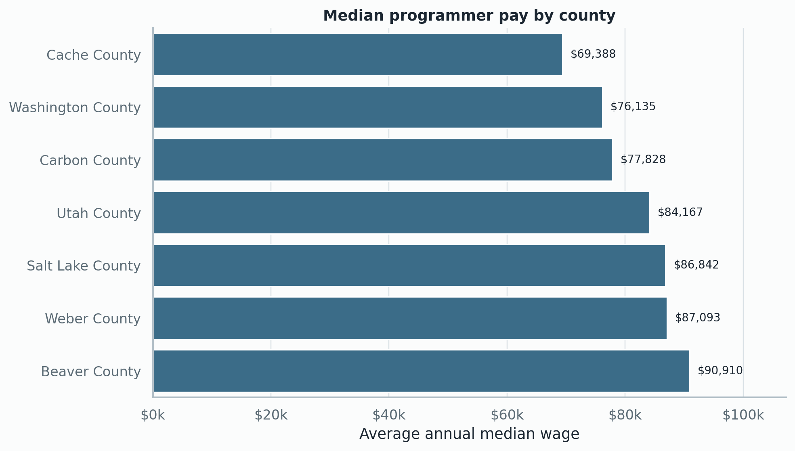
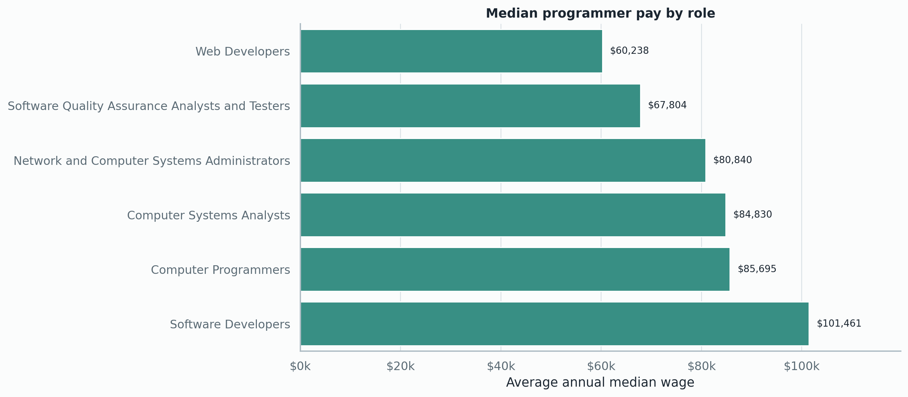
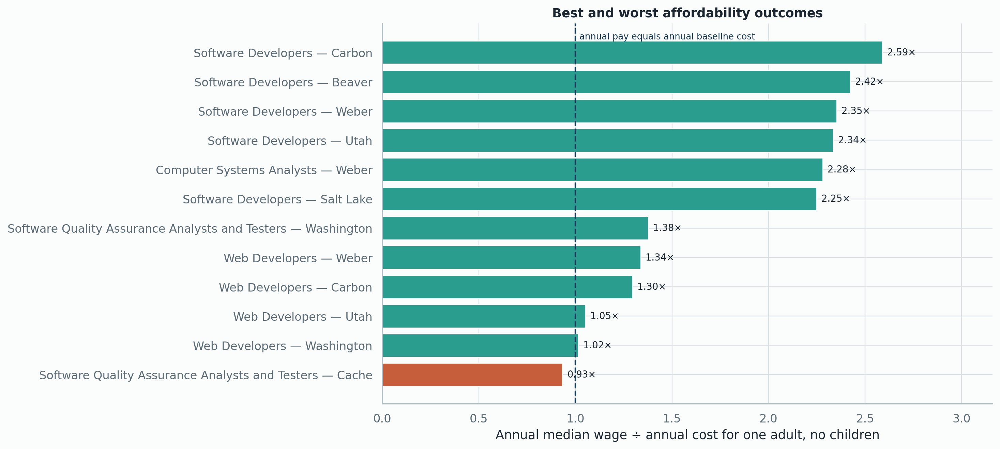
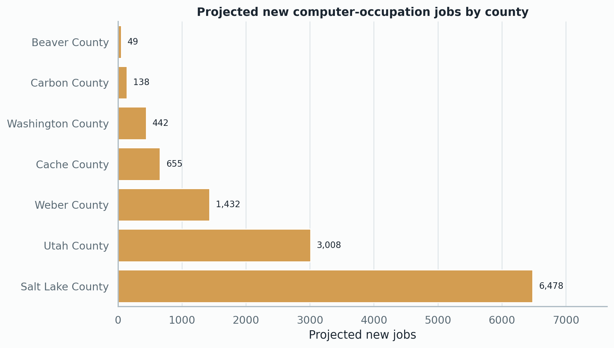
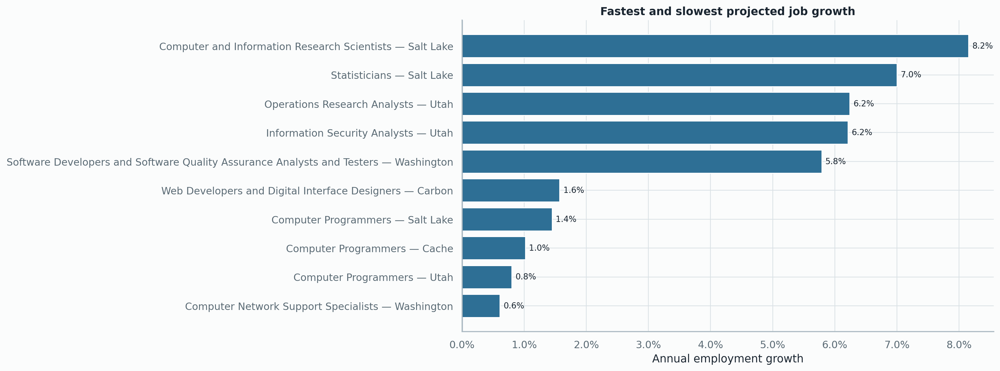
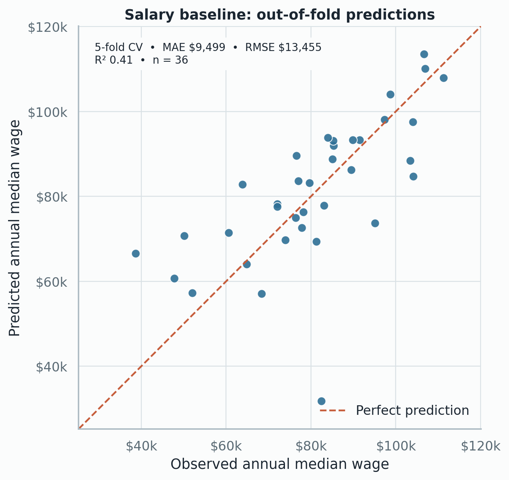

# Utah Programmer Job Market Analysis

An exploratory data project about where a programmer in Utah could find the best balance of pay, living costs, and job opportunity. It combines 2024 wage and employment-projection data with county-level household budgets to answer a practical question: **where does a programmer's pay go furthest?**

This refresh keeps the original project question and source files, while making the calculations reproducible, the charts easier to read, and the conclusions more explicit about what the data can and cannot support.

## Highlights

- **Beaver County** has the highest average annual median wage across the six analyzed programmer roles: **$90,910**. Weber and Salt Lake counties follow at roughly **$87,000**.
- Under the stated one-adult/no-children cost baseline, **Software Developers in Carbon County** have the strongest affordability result: a **$104,020** annual median wage against **$40,152** in annual baseline costs, or **2.59×**.
- **Salt Lake County** has the largest projected increase among the detailed computer occupations represented in the wage data: **6,478** new jobs. Utah County follows with **3,008**.
- The county-and-role salary baseline explains some, but not all, wage variation. Five-fold cross-validation produces an RMSE of **$13,455** and R² of **0.41** across 36 wage observations, so it should be read as an explanatory baseline rather than a salary forecast.

## Findings

### Pay by location



The chart averages the available annual median wages for six programmer-related roles within each workforce area. It is useful for comparing the source's reporting areas, not for estimating every programmer's individual offer.

### Pay by role



Software Developers lead the analyzed roles at an average annual median wage of **$101,461**. Web Developers average **$60,238**. These are descriptive source-data comparisons; the project does not make causal claims about why the difference exists.

### Affordability by role and county



Affordability is calculated as:

```text
Annual median wage / annual cost of living
```

For the headline view, annual cost of living is always the 2024 county budget for **one adult with no children (`1p0c`)**. A value above 1 means that annual wage exceeds that household's annual baseline budget. This is a comparison metric, not a complete personal budget: taxes, commuting, housing choices, debt, benefits, and household circumstances can materially change the result.

### Projected opportunity





The opportunity charts use only detailed projection rows that match an occupation in the wage source. This deliberately excludes broader roll-up categories so a category is not counted once on its own and again through its components.

### Salary baseline check



The model uses only two inputs—workforce county and job title—then evaluates its predictions on held-out folds. It is included to show how much of the observed salary variation those two fields capture, not as a production recommendation engine.

## Method

1. Load the consolidated 2024 wage data and exclude statewide and national totals.
2. Map each workforce reporting area to the county used in the cost-of-living data.
3. Join each wage observation to exactly one county cost record for the selected household baseline.
4. Calculate wage-to-cost affordability ratios.
5. Join detailed occupation projections to the raw wage occupation list before aggregating projected new jobs.
6. Evaluate a county-and-role linear-regression baseline using five-fold cross-validation.

The project intentionally no longer reports the former pairwise t-test table. That analysis tested affordability ratios rather than the salary differences described in the prior README, and repeated comparisons would require a more careful statistical design and correction for multiple testing.

## Project structure

```text
.
├── src/utah_job_market/
│   ├── data.py        # Source loading, validation, and area-to-county mapping
│   ├── analysis.py    # Affordability and cross-validated model calculations
│   └── visuals.py     # Shared styling and chart generation
├── scripts/run_analysis.py
├── tests/test_analysis.py
├── figures/           # Regenerated charts used in this README
├── project.ipynb      # Original exploratory notebook, retained for project history
└── *.xlsx / *.csv     # Original local source data
```

## Run it

The source workbooks are included, so a network connection is not required after installing the Python dependencies.

```bash
python -m venv .venv
source .venv/bin/activate
python -m pip install -r requirements.txt
python scripts/run_analysis.py
PYTHONPATH=src python -m unittest discover -s tests -v
```

The analysis command regenerates the six README charts in `figures/`. It validates the required columns, fails on unmapped workforce areas, and checks that every salary observation has one—and only one—matching baseline cost record.

## Data and scope

| Source file | Used for | Vintage / limitation |
|---|---|---|
| `wages.xlsx` | Six-role wage comparisons and salary baseline | Local 2024 project source; some role-area wage values are missing. |
| `fbc_data_2024.xlsx` | County household cost baseline | 2024 Family Budget Calculator-style county budgets; results change with household type. |
| `Wage.xlsx` + `projection.xlsx` | Detailed occupation growth and new-job totals | Local projection extracts; interpreted as projections, not realized employment. |

The analysis covers the workforce areas available in the supplied files: Cache, Beaver, Carbon, Weber, Utah, Salt Lake, and Washington counties. Metro reporting areas are mapped to a single county solely to align the two source formats, which is a simplifying assumption.

## Original deliverables

The original presentation and paper remain available in [`analysis/`](analysis/). The earlier notebook charts are retained in `figures/` for historical reference; the six charts embedded above are the refreshed, reproducible set.

## Sources

- [Utah Department of Workforce Services](https://jobs.utah.gov/)
- [U.S. Bureau of Labor Statistics, Occupational Employment and Wage Statistics](https://www.bls.gov/oes/)
- [Original project paper](analysis/Utah%20Programmer%20Job%20Market%20Analysis.pdf)
